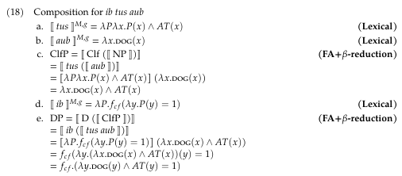

# Introduction

- This project argues for a choice functional analysis of the indefinite article in White Hmong.

- Our discussion includes the indefinite article *ib* and two common classifiers (*tus* and *cov*).

--

## Research questions

1. What are the individual meanings of *ib*, *tus*, and *cov*?

2. How does the indefinite article *ib* combine with with *tus* and *cov* classifier phrases?

---

# Introduction

## Outline 

1. Introduction 

2. Hmong Data

3. Proposal: bare classifier phrases

4. Proposal: indefinite phrases

5. Conclusion

---

class: center, middle

# Hmong Data

---

# Data

## Speaker information

- All of my data and discussion are based on elicitation on Zoom with **Ying** and in person with **Keng**, two White Hmong speakers who were raised in Wisconsin (WI). 

--

- Keng was born in WI and Ying immigrated to the US at age 4.

- Also they're siblings

---

# Data

## Definites (Bare classifier phrases)

```{r, fig.retina=2, out.width="60%", out.height="auto", dpi=900, echo=FALSE}

```

--

(1) ***tus aub*** can only refer to 1 unique, specific dog in the relevant context

(2) ***cov aub*** can only refer to the full group of dogs in the context


---

# Data

## Indefinites 

```{r, fig.retina=1, out.width="55%", out.height="55%", dpi=900, echo=FALSE}

```

--

(3) ***ib tus aub*** can refer to any one of the dogs in the context

(4) ***ib cov aub*** can refer to any subgroup of the dogs in the context

---

# Data

## Indefinites

```{r, fig.retina=2, out.width="40%", out.height="25%", dpi=900, echo=FALSE}
knitr::include_graphics("./images/data_bad_indef.png")
```

(5) ***ib*** requires a classifier phrase


---

class: center, middle

# Proposal: bare classifier phrases (definites)

---

# Proposal 

## Definites

```{r, fig.retina=2, out.width="55%", out.height="auto", dpi=900, echo=FALSE}
knitr::include_graphics("./images/clf_denotations.png")
```

--

**Classifiers:**

- both take a bare noun as their argument

--

- *tus* requires that the NP's referent be "atomic" ("AT(x)") but *cov* has no atomicity requirement

--

- when they combine with an NP (bare noun, type *e*), they output a predicate type (⟨*e,t*⟩)


---

# Proposal

## Definites 

```{r, fig.retina=2, out.width="95%", out.height="auto", dpi=900, echo=FALSE}

```

**What do I need to know about this operator?**

--

- ι is roughly equivalent to a definite article like *the* 

- as a null equivalent to *the*, *the dogs* would pick out the largest plurality of dogs (Chierchia 1997)

--

**For Hmong,**

- this ι operator gives us the unique definite reading for bare classifier phrases with *tus*

- and it gives us a maximal reading in bare classifier phrases with *cov*

---

# Proposal

## Definites (structures)

.pull-left[
```{r, fig.retina=2, out.width="100%", out.height="120%", dpi=900, echo=FALSE}

```
]


.pull-right[
```{r, fig.retina=2, out.width="100%", out.height="120%", dpi=900, echo=FALSE}
knitr::include_graphics("./images/tree_cov_aub.png")
```
]

---

# Proposal

## Definites (composition)

```{r, fig.retina=2, out.width="120%", out.height="120%", dpi=900, echo=FALSE}
knitr::include_graphics("./images/tus_aub_composition.png")
```

---

# Proposal

## Definites (composition)

```{r, fig.retina=2, out.width="120%", out.height="120%", dpi=900, echo=FALSE}
knitr::include_graphics("./images/cov_aub_composition.png")
```

---

class: center, middle

# Proposal: Indefinite phrases

---

# Proposal

## Indefinites

```{r, fig.retina=2, out.width="50%", out.height="auto", dpi=900, echo=FALSE}
knitr::include_graphics("./images/ib.png")
```

--

**What does this mean?**

- *ib* takes a predicate of type ⟨*e,t*⟩ as an argument 

- it outputs another predicate of type ⟨*e,t*⟩

--

- the choice function applies to a grouping of entities and arbitrarily selects one of the entities as its referent (Winter 1997)


---

# Proposal

## Contexts 

```{r, fig.retina=2, out.width="50%", out.height="auto", dpi=900, echo=FALSE}

```

--

**How are the referents for each phrase determined in this context?**

--

- (14a) is a definite phrase, so its reference is typically determined by 1) discourse relevance of a certain dog in the context, 2) pointing at a specific dog

--

- (14b) is truly so non-specific that each dog in the context is an equally likely referent. if a speaker meant to refer to one of the three dogs specifically, they would say *tus aub* instead of *ib tus aub*

--

- the choice function analysis correctly captures the random referent in the context

---

# Proposal 

## Contexts 

```{r, fig.retina=2, out.width="75%", out.height="auto", dpi=900, echo=FALSE}
knitr::include_graphics("./images/pl_contexts.png")
```
--
```{r, fig.retina=2, out.width="90%", out.height="auto", dpi=900, echo=FALSE}

```

--

**How are the referents for each phrase determined in this context?**

--

- (15a) is a definite phrase, so the ι operator requires it to refer to the full group in the context

--

- (15b) shows that *ib cov aub* can semantically refer to any atomic or non-atomic entity in the context. **BUT**, because of _antipresupposition_, the options in (15c) are the only pragmatically sound referents in the context for *ib cov aub*  


---

# Proposal

### Antipresupposition

**What is it?**

--

Antipresupposition ***"imposes the condition that the interlocutors not take the truth of a certain proposition for granted"*** (Percus 2006)

--

- for plural indefinites, the choice function does not select the largest entity, otherwise, ι would be the determiner chosen for the utterance instead of *ib* 

--

- the choice function also does not select an atomic entity, otherwise, the classifier *tus* would have been chosen instead of *cov*

--

- **thus,** antipresupposition yields the non-singular and non-maximal entities as the only pragmatically sound options when *ib cov aub* is uttered


---

# Proposal

## Indefinites (structures)

.pull-left[
```{r, fig.retina=2, out.width="100%", out.height="100%", dpi=900, echo=FALSE}

```
]

.pull-right[
```{r, fig.retina=2, out.width="100%", out.height="100%", dpi=900, echo=FALSE}

```
]

---

# Proposal 

## Indefinites (composition)

```{r, fig.retina=2, out.width="120%", out.height="auto", dpi=900, echo=FALSE}

```

---

# Proposal

## Indefinites (composition)

```{r, fig.retina=2, out.width="120%", out.height="auto", dpi=900, echo=FALSE}

```
---

# Conclusion 

- analyzing *ib* as a choice function correctly captures how different referents are determined with singular and plural classifiers

--

- singular indefinite phrases (***ib tus NP***) are highly non-specific and thus can refer to any atomic entity in the context 

--

- plural indefinite phrases (***ib cov NP***) are also non-specific, but semantically can refer to any atomic or non-atomic entity in the context

--

- along with the concept of antipresupposition, a choice functional analysis correctly predicts that *ib cov NP* can only refer to non-maximal and non-atomic entities in the context

---

# Selected references

Chierchia, Gennaro. 1998. Reference to kinds across language. Natural Language Semantics
6:339–405.


Chierchia, Gennaro. 1997. Partitives, Reference to Kinds and Semantic Variation. SALT VII, 73-98.
Cornell University. Ithaca, NY.


Elbourne, Paul D. 2005. On the acquisition of Principle B. Linguistic Inquiry 36:333–366


Jenks, Peter. 2018. Articulated definiteness without articles. Linguistic Inquiry 49:501–536.


Percus, O. 2006. "Antipresuppositions." In A. Ueyama(ed.), Theoretical and Empirical Studies of
Reference and Anaphora: Toward the establishment of generative grammar as an empirical science, Report of the
Grant-in-Aid for Scientific Research (B), Project No. 15320052, Japan Society for the Promotion of Science, 52-73. 


Winter, Y. 1997. Choice Functions and the Scopal Semantics of Indefinites. Linguistics and Philosophy
20, 399–467. https://doi.org/10.1023/A:1005354323136
 

---

class: center, middle

# Thank you! Questions? Comments?

--

# *(Cov aub!)* 


.pull-center[
```{r, out.width="30%", out.height="25%", dpi=900, echo=FALSE}


knitr::include_graphics("./images/mars.jpeg")

```
]
