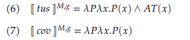

# Introduction

- This project argues for a choice functional analysis of the indefinite article in White Hmong.

- Our discussion includes the indefinite article *ib* and two common classifiers (*tus* and *cov*).

--

## Research questions

1. What are the individual meanings of *ib*, *tus*, and *cov*?

2. How does the indefinite article *ib* combine with with *tus* and *cov* classifier phrases?

---

# Introduction

## Outline 

1. Introduction 

2. Hmong Data

3. Proposal: definites

4. Proposal: indefinites

5. Conclusion

---

class: center, middle

# Hmong Data

---

# Data

## Demographics

- All of my data and discussion are based on elicitation on Zoom with Mai-Ying Xiong and in person with Keng
Xiong, two White Hmong speakers who were raised in Wisconsin (WI). 

- Keng was born in WI and Ying immigrated to the US at age 4.

---

# Data

## Definites (Bare classifier phrases)

```{r, out.width="60%", out.height="auto", dpi=900, echo=FALSE}
knitr::include_graphics("./images/data_bare_clfp.png")
```

---

# Data

## Indefinites 

```{r, out.width="55%", out.height="55%", dpi=900, echo=FALSE}
knitr::include_graphics("./images/data_indefinites.png")
```


--

```{r, out.width="40%", out.height="25%", dpi=900, echo=FALSE}
knitr::include_graphics("./images/data_bad_indef.png")
```


---

class: center, middle

# Proposal: definites

---

# Proposal 

## Definites

```{r, out.width="55%", out.height="auto", dpi=900, echo=FALSE}

```

--

**Classifiers:**

- both take a bare noun as their argument

--

- *tus* requires that the NP's referent be "atomic" ("AT(x)") but *cov* has no atomicity requirement

--

- when they combine with an NP (bare noun, type *e*), they output a predicate type (⟨*e,t*⟩)


---

# Proposal

## Definites 

```{r, out.width="95%", out.height="auto", dpi=900, echo=FALSE}
knitr::include_graphics("./images/iota.png")
```

**what's it do???**

---

# Proposal

## Definites

.pull-left[
```{r, out.width="100%", out.height="120%", dpi=900, echo=FALSE}
knitr::include_graphics("./images/tree_tus_aub.png")
```
]


.pull-right[
```{r, out.width="100%", out.height="120%", dpi=900, echo=FALSE}

```
]

---

# Proposal

## Definites

```{r, out.width="120%", out.height="120%", dpi=900, echo=FALSE}

```

---

# Proposal

## Definites 

```{r, out.width="120%", out.height="120%", dpi=900, echo=FALSE}

```

---

class: center, middle

# Proposal: Indefinites

---

# Proposal

## Indefinites

```{r, out.width="50%", out.height="auto", dpi=900, echo=FALSE}

```

**what's this mean???**


---

# Proposal

## Contexts 

```{r, out.width="50%", out.height="auto", dpi=900, echo=FALSE}
knitr::include_graphics("./images/sg_contexts.png")
```

**how are the referents determined in both sentences???**

---

# Proposal 

## Contexts 

```{r, out.width="75%", out.height="auto", dpi=900, echo=FALSE}

```
--
```{r, out.width="90%", out.height="auto", dpi=900, echo=FALSE}
knitr::include_graphics("./images/antipresupposition.png")
```

--

**how are the referents determined???**

---

# Proposal

### Antipresupposition

**FILL IN???**

---

# Conclusion 

**FILL IN???**

---

## References 

**FILL IN???**

Slides created via the R package [**xaringan**](https://github.com/yihui/xaringan).

The chakra comes from [remark.js](https://remarkjs.com), [**knitr**](https://yihui.org/knitr/), and [R Markdown](https://rmarkdown.rstudio.com).

---

class: center, middle

# Thank you! Questions? Comments?

--

# (Cov aub!) 


.pull-center[
```{r, out.width="30%", out.height="25%", dpi=900, echo=FALSE}
knitr::include_graphics("./images/apollo.jpg")

knitr::include_graphics("./images/copper.jpeg")

knitr::include_graphics("./images/mars.jpg")

```
]
